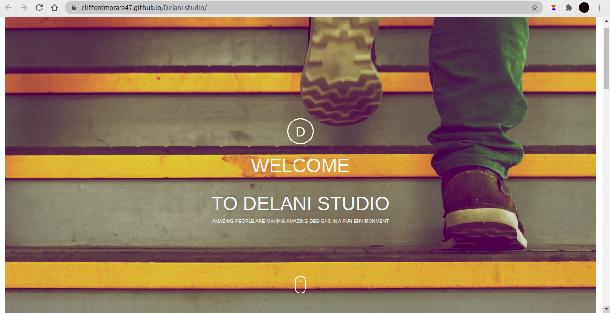

# _DELANI STUDIO_
***

---
## _About_
_Delani studio is based on doing the following services;_
- Drafting application for companies and organisations.
- Drafting out websites for companies.
- Marketing our client's products.
- And much more services.
---

## _Author_
_Delani studio was founded and set up by Clifford Morara. A student from Moringa School._
***

## _Visit website_
[Delani-Studio](https://cliffordmorara47.github.io/Delani-studio/ "Delani-Studio")

## _Technologies_
_The following languages were used to come up with the website;_
_The following technologies were used to come up with the website._

 1. [Javascript](https://en.wikipedia.org/wiki/JavaScript "JS")

 1. [HTML5](https://en.wikipedia.org/wiki/HTML5 "Hypertext")

 1. [CSS](https://en.wikipedia.org/wiki/CSS "stylesheet")

 1. [Bootstrap](https://getbootstrap.com/ "bootstrap")
 1. [Jquery](https://jquery.com/ "Jquery")
 ***
# _BDD_
***
# _Installation Process_
 ## _Contacts_
 _To contact me in regards to the above site, you can Call me on;_
 - [+254715463455]()
 - [+254710566344]()

 _Or you can send an E-mail to;_
 - [cliffordmorara52@gmail.com]()
 - [delanistudio@hotmail.com]()

 ***
 # Copyright and Licence
 MIT License

Copyright (c) 2020 Cliffordmorara47

Permission is hereby granted, free of charge, to any person obtaining a copy
of this software and associated documentation files (the "Software"), to deal
in the Software without restriction, including without limitation the rights
to use, copy, modify, merge, publish, distribute, sublicense, and/or sell
copies of the Software, and to permit persons to whom the Software is
furnished to do so, subject to the following conditions:

The above copyright notice and this permission notice shall be included in all
copies or substantial portions of the Software.

THE SOFTWARE IS PROVIDED "AS IS", WITHOUT WARRANTY OF ANY KIND, EXPRESS OR
IMPLIED, INCLUDING BUT NOT LIMITED TO THE WARRANTIES OF MERCHANTABILITY,
FITNESS FOR A PARTICULAR PURPOSE AND NONINFRINGEMENT. IN NO EVENT SHALL THE
AUTHORS OR COPYRIGHT HOLDERS BE LIABLE FOR ANY CLAIM, DAMAGES OR OTHER
LIABILITY, WHETHER IN AN ACTION OF CONTRACT, TORT OR OTHERWISE, ARISING FROM,
OUT OF OR IN CONNECTION WITH THE SOFTWARE OR THE USE OR OTHER DEALINGS IN THE
SOFTWARE.